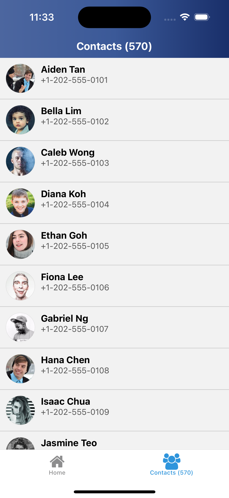

# Introduction

This project is built with Expo React Native and showcases the use of FlashList from Shopify for high-performance list scrolling. It serves as a proof of concept (POC) for custom pull-to-refresh handling on list views, featuring a custom animation on the header during the pull-to-refresh gesture. The app also demonstrates a custom skeleton loader component.

## Screenshots

Contact List Screen:  


Video Demo:  


## Project Setup

To run this project, clone the repository and install dependencies:

```bash
npm install
```

### Running on Simulators

For iOS:

```bash
npm run ios
```

For Android:

```bash
npm run android
```
